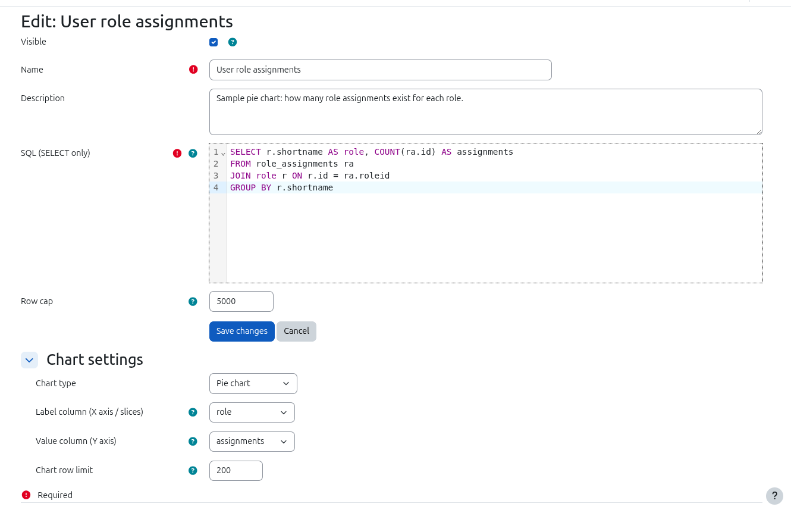
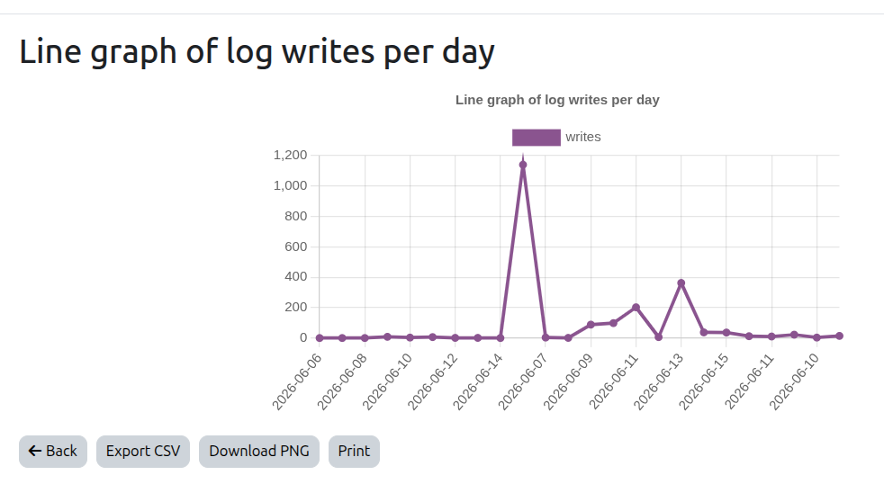
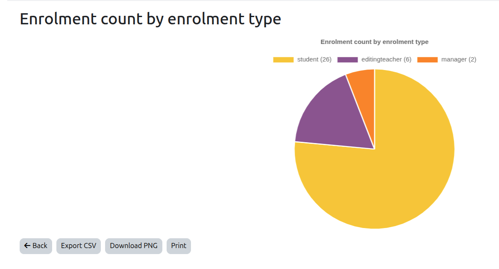

<p align="center"></p>

# Report Sources — User Documentation

Report Sources (`local_reportsources`) lets you write a SQL `SELECT` query, click **Publish**, and get a fully-configurable Moodle **Report Builder** report — no PHP required. Publishing turns your SQL into a database view, reads its columns, and registers a Report Builder data source pointing at that view. From there you choose columns, add filters, sort, chart, schedule exports, and control who can see it. Warning report writing tools run the risk of leaking information, test and double check who can see the information in anything created.

---

## Contents

1. [Requirements](#requirements)
2. [Who can do what (capabilities)](#who-can-do-what-capabilities)
3. [Quick start](#quick-start)
4. [The edit form, field by field](#the-edit-form-field-by-field)
5. [Writing SQL](#writing-sql)
6. [Placeholders](#placeholders)
7. [The SQL editor (highlight + autocomplete)](#the-sql-editor-highlight--autocomplete)
8. [Generating SQL with AI](#generating-sql-with-ai)
9. [Publishing and building the report](#publishing-and-building-the-report)
10. [Who can view the report (audiences)](#who-can-view-the-report-audiences)
11. [Per-user filter](#per-user-filter)
12. [Charts](#charts)
13. [Emailing reports on a schedule](#emailing-reports-on-a-schedule)
14. [Managing report views (list page)](#managing-report-views-list-page)
15. [Export and import](#export-and-import)
16. [Validation and error messages](#validation-and-error-messages)
17. [Admin settings](#admin-settings)
18. [Database privilege check](#database-privilege-check)
19. [Troubleshooting](#troubleshooting)

---

## Requirements

- Moodle 4.5 – 5.2 (stable Report Builder API).
- The Moodle database user must have `CREATE VIEW` and `DROP` privileges on the schema.

Confirm the privileges from **Site admin → Local plugins → Report sources → Run database view privilege test**.

---

## Who can do what (capabilities)

| Capability | Scope | Lets you |
|---|---|---|
| `local/reportsources:author` | System | Write and save report views |
| `local/reportsources:approve` | System | Publish / unpublish report views |
| `local/reportsources:view` | System or course | Run published report views |
| `local/reportsources:viewall` | System | See every report view, regardless of audience |
| `local/reportsources:viewown` | Course | Run report views in your own course |

Assign these to roles at **Site admin → Users → Permissions → Define roles**.

> **Two separate gates.** These capabilities control the **plugin's own** pages (the list, edit, run links). *Who can open the finished Report Builder report* is controlled separately by the report's **audience** and **course scope** — see [Who can view the report](#who-can-view-the-report-audiences).

### Letting non-administrators author reports

By default only **site managers** (and site admins) can author report views, because `author`, `approve`, and `viewall` are defined at the **system** context and ship on the Manager archetype. A Manager assigned only in a **course or category** does **not** get them — authoring is always a site-wide privilege.

To let specific trusted people author and publish reports without making them full site Managers, create a dedicated role:

1. **Site admin → Users → Permissions → Define roles → Add a new role.**
2. Start from **No role / archetype**.
3. Under **Context types where this role may be assigned**, tick **System**.
4. Name it e.g. *Report author*, and **Allow**:
   - `local/reportsources:author` — write and save report views.
   - `local/reportsources:approve` — publish them (omit this if a separate approver should publish).
   - `local/reportsources:viewall` — see and manage everyone's report views (optional).
5. Save, then assign people via **Site admin → Users → Permissions → Assign system roles → Report author**.

Holders can then create report views **anywhere** (authoring is system-wide; there is no per-course authoring) and — with `approve` — publish them.

> **⚠️ This is a high-trust role.** Authoring a report means writing an arbitrary SQL `SELECT`, which can read almost any table in the database (only a small denylist such as `config`, `sessions`, and password tables is blocked). The role is therefore effectively a **site-wide data-read** grant — Moodle flags it as carrying *personal-data* and *data-loss* risk. Assign it only to people you would trust with direct read access to the database, and confirm any tables/columns that must never be exposed are covered by the denylist (see [Admin settings](#admin-settings)).

---

## Quick start

1. Go to **Report sources** in the navigation (or `/local/reportsources/index.php`) and click **New report view**.
2. Enter a **Name** and your **SQL** (a single `SELECT`).
3. Click **Save** — the query is validated, then stored as a **draft**.
4. Click **Publish** on the draft. The plugin builds the view and a Report Builder report.
5. Click **Open report** to view it, or **Edit in Report Builder** to add columns, filters, and audiences.

---

## The edit form, field by field



| Field | What it does |
|---|---|
| **Course scope** | The course this report belongs to. Leave empty for a **site-wide** report. The course sets (a) the context where the report's "view report" permission is checked, and (b) the default audience. Re-scope an existing draft here — e.g. an imported draft that landed site-wide because its original course did not exist on this site. Course-specific audience options refresh after you save and reopen the form. |
| **Visible** | When ticked, the published report appears in the listing for anyone with the `view` capability. Unticking hides it from the list (useful while refining) without deleting the underlying view or report. Authors with `viewall` and managers always see hidden views. |
| **Name** | The title shown on the finished Report Builder report. Required. |
| **Description** | Optional notes for yourself or other authors. |
| **SQL (SELECT only)** | A single `SELECT` or `WITH … SELECT`. See [Writing SQL](#writing-sql). Required. |
| **Audience** | Who can open the published report. See [Who can view the report](#who-can-view-the-report-audiences). |

Two more sections appear **only after the query is published** (their fields depend on the live view's columns):

| Field | What it does |
|---|---|
| **Per-user filter → Restrict to viewing user** | Optionally scope the report so each person sees only their own rows. See [Per-user filter](#per-user-filter). |
| **Chart settings** | Type, label/value columns, and row limit for an optional chart. See [Charts](#charts). |

Click **Save changes** to store. Editing the SQL of a published view reverts it to draft — re-publish when ready.

---

## Writing SQL

### Basics

- A single `SELECT` or `WITH … SELECT`. No `INSERT`, `UPDATE`, `DELETE`, or multiple statements.
- No semicolons.
- You do **not** need to type the `{}` braces. Just write the bare table name (e.g. `user`, `course`) and the plugin wraps it in Moodle's `{tablename}` syntax on save, resolving it to the real prefixed table name (`mdl_user`, …) at runtime. Writing the braces yourself (`{user}`) also works if you prefer.

### Always alias tables

Because `user` resolves to `mdl_user`, give every table a short alias so column references stay unambiguous:

```sql
SELECT u.id, u.firstname, u.lastname, u.email
FROM user u
WHERE u.deleted = 0
```

### Multi-table joins — avoid `SELECT *`

A database view cannot have two columns with the same name. When you join tables that share a column (both have `id`), alias at least one, or publishing fails with a duplicate-column error.

```sql
-- WRONG: both tables have 'id' — publish fails
SELECT *
FROM user u
JOIN forum_posts fp ON fp.userid = u.id

-- CORRECT: alias every ambiguous column
SELECT u.id       AS userid,
       u.firstname,
       u.lastname,
       fp.id      AS postid,
       fp.subject,
       fp.created AS postcreated
FROM user u
JOIN forum_posts fp ON fp.userid = u.id
```

Every `JOIN` also needs an `ON` (or `USING`) condition — a join with no condition is rejected.

### Example: students enrolled on a course

```sql
SELECT u.id        AS userid,
       u.firstname,
       u.lastname,
       c.id        AS courseid,
       c.fullname  AS coursename
FROM user u
JOIN user_enrolments ue ON ue.userid = u.id
JOIN enrol e            ON e.id = ue.enrolid
JOIN course c           ON c.id = e.courseid
WHERE u.deleted = 0
```

### Example: CTE (WITH … SELECT)

```sql
WITH active AS (
    SELECT id, firstname, lastname
    FROM user
    WHERE deleted = 0 AND suspended = 0
)
SELECT a.id        AS userid,
       a.firstname,
       a.lastname,
       c.fullname  AS course
FROM active a
JOIN user_enrolments ue ON ue.userid = a.id
JOIN enrol e            ON e.id = ue.enrolid
JOIN course c           ON c.id = e.courseid
```

### Things to watch

- **`?` character** — the database layer treats `?` as a parameter placeholder. If a `?` belongs in a URL string, use `CHAR(63)`:
  ```sql
  CONCAT('…/view.php', CHAR(63), 'id=', c.id)
  ```
- **Placeholders like `##`** — replace any leftover placeholder with a real value before saving (e.g. change `l.userid = ##` to `l.userid = 2`).
- **Database-specific date functions** — MySQL-only functions (`DATE_FORMAT`, `DAYOFWEEK`, …) or PostgreSQL-only functions (`DATE_TRUNC`, …) raise a **warning**, not a block. The query still saves but may break if the site moves to a different database engine. PostgreSQL functions unsupported by MySQL are blocked outright. To convert a stored Unix-epoch column to a date in a way that works on **both** engines, use the [`%%TIMESTAMP(expr)%%`](#timestampexpr--epoch-to-date) and [`%%NOW%%`](#now--current-unix-time) tokens instead of a database-specific function.

### Schema reference

Full Moodle ER diagram: [examulator.com/er](https://www.examulator.com/er). For inspiration, see the [Moodle ad-hoc contributed reports](https://docs.moodle.org/502/en/ad-hoc_contributed_reports).

---

## Placeholders

The plugin supports a small, fixed set of placeholder forms in your SQL. Everything else that looks like a placeholder is **rejected** at save time.

| Placeholder | Replaced with | Notes |
|---|---|---|
| `{tablename}` | Prefixed table name (`{user}` → `mdl_user`) | |
| `%%WWWROOT%%` | Site address (`$CFG->wwwroot`) | Case-insensitive |
| `%%COURSEID%%` | The report's bound course id | Requires a course scope on the query |
| `%%COURSECONTEXT%%` | The bound course's context row id (`mdl_context.id`) | Requires a course scope on the query |
| `%%CONTEXT_COURSE%%` (and `%%CONTEXT_SYSTEM%%`, `%%CONTEXT_USER%%`, `%%CONTEXT_COURSECAT%%`, `%%CONTEXT_MODULE%%`, `%%CONTEXT_BLOCK%%`) | The matching Moodle context-**level** constant (`%%CONTEXT_COURSE%%` → `50`) | No course scope needed |
| `%%NOW%%` | Current Unix time (integer seconds) | Cross-database |
| `%%EPOCH(datetime)%%` | A datetime literal/expression as Unix time (integer seconds) | Cross-database |
| `%%TIMESTAMP(expr[, format])%%` | `expr` (an epoch column) as a date, optionally formatted | Cross-database; date-sortable |

All are substituted once, when the view is built — the view is a fixed `CREATE VIEW`, so these bake a value in; they are **not** per-request parameters.

### `{tablename}` — table names

Curly-brace table syntax, resolved to the prefixed table name (`{user}` → `mdl_user`) when the view is built. **Braces are optional** — write the bare name (`user`) and the editor adds them on save. Type them yourself only if you prefer.

```sql
SELECT u.id, u.firstname FROM user u WHERE u.deleted = 0
```

### `%%WWWROOT%%` — your site URL

Replaced with the site address (`$CFG->wwwroot`) when the view is built. Use it to embed absolute links without hard-coding the domain — handy for a clickable cell built with `CONCAT`. Case-insensitive.

```sql
SELECT u.id,
       CONCAT('<a href="', %%WWWROOT%%, '/user/view.php', CHAR(63), 'id=', u.id, '">',
              u.firstname, ' ', u.lastname, '</a>') AS profilelink
FROM user u
WHERE u.deleted = 0
```

> Note the `CHAR(63)` for the `?` in the URL — see [Things to watch](#things-to-watch).

### `%%COURSEID%%` — the report's course

Replaced with the course id the query is scoped to. Because the value is baked into the view at publish time, a query using `%%COURSEID%%` **must** carry a course scope (set the *Course* field on the edit form) — otherwise it is rejected with *"this report needs a course scope"*.

```sql
SELECT u.firstname, u.lastname
FROM role_assignments ra
JOIN context ctx ON ctx.id = ra.contextid AND ctx.contextlevel = 50
JOIN course  c   ON c.id = ctx.instanceid AND c.id = %%COURSEID%%
JOIN user    u   ON u.id = ra.userid
```

### `%%COURSECONTEXT%%` — the course's context id

Replaced with the bound course's **context row id** (`mdl_context.id`) when the view is built. This is *not* the context level — the course context level is always `50` (`CONTEXT_COURSE`), but the `mdl_context.id` row differs for every course, so it cannot be hard-coded. Like `%%COURSEID%%`, it requires a course scope on the query.

Use it to skip the `mdl_context` join when you already know the course. The `%%COURSEID%%` example above becomes:

```sql
SELECT u.firstname, u.lastname
FROM role_assignments ra
JOIN user u ON u.id = ra.userid
WHERE ra.contextid = %%COURSECONTEXT%%
```

### `%%CONTEXT_COURSE%%` and friends — context-level constants

Replaced with the integer value of the matching Moodle context **level** constant, so you can write the name instead of a magic number when filtering `mdl_context.contextlevel`:

| Token | Value | Core constant |
|---|---|---|
| `%%CONTEXT_SYSTEM%%` | `10` | `CONTEXT_SYSTEM` |
| `%%CONTEXT_USER%%` | `30` | `CONTEXT_USER` |
| `%%CONTEXT_COURSECAT%%` | `40` | `CONTEXT_COURSECAT` |
| `%%CONTEXT_COURSE%%` | `50` | `CONTEXT_COURSE` |
| `%%CONTEXT_MODULE%%` | `70` | `CONTEXT_MODULE` |
| `%%CONTEXT_BLOCK%%` | `80` | `CONTEXT_BLOCK` |

These are fixed constants, so no course scope is required. Don't confuse them with [`%%COURSECONTEXT%%`](#coursecontext--the-courses-context-id), which is a specific context *row* id.

```sql
SELECT c.fullname, COUNT(DISTINCT ra.userid) AS students
FROM context ctx
JOIN course c ON c.id = ctx.instanceid
JOIN role_assignments ra ON ra.contextid = ctx.id
WHERE ctx.contextlevel = %%CONTEXT_COURSE%%
GROUP BY c.id, c.fullname
```

### `%%NOW%%` — current Unix time

Replaced with the current time as integer epoch seconds. Use it for date-window filters without a database-specific date function, so the query runs on MySQL/MariaDB **and** PostgreSQL. Combine with plain arithmetic (`86400` = seconds per day).

```sql
-- Users who logged in within the last 120 days
SELECT id, username
FROM user
WHERE lastlogin > %%NOW%% - (120 * 86400)
```

### `%%EPOCH(datetime)%%` — date literal to epoch

The mirror image of `%%TIMESTAMP%%`. It converts a **date/time you write** into Unix epoch seconds, so you can compare it against an epoch column (like `timecreated`, `lastaccess`) on **both** MySQL/MariaDB and PostgreSQL. It expands to `UNIX_TIMESTAMP(arg)` on MySQL and `EXTRACT(EPOCH FROM arg)::int` on PostgreSQL — pick the token and the plugin emits the right one.

Use it for fixed date-window filters:

```sql
-- Log writes in January 2015
SELECT COUNT(*) AS writes
FROM logstore_standard_log
WHERE timecreated >  %%EPOCH('2015-01-01 00:00:00')%%
  AND timecreated <= %%EPOCH('2015-01-31 23:59:59')%%
```

Notes:

- Quote string literals: `%%EPOCH('2015-01-01 00:00:00')%%`. The argument can also be a column or expression.
- The argument **cannot contain a `%` character** (the token scan stops at `%`).
- Use a **real calendar date**. An impossible date such as `'2027-06-31'` (June has 30 days) returns `NULL` on MySQL, and `timecreated <= NULL` is never true — the query silently returns **0 rows**.
- For the **current** time use [`%%NOW%%`](#now--current-unix-time), not `%%EPOCH%%`.
- Native `UNIX_TIMESTAMP()` still works but is MySQL-only and raises a portability warning — prefer the token.

### `%%TIMESTAMP(expr)%%` — epoch to date

Marks a stored Unix-epoch value (`expr`) as a **date** column. Report Builder then renders it as a date, with date filtering, and — because the underlying value stays the raw epoch — it **sorts chronologically** (not as text). A plain epoch column without the token shows as a meaningless integer instead.

```sql
SELECT u.id,
       u.username,
       %%TIMESTAMP(u.lastaccess)%% AS lastaccess,
       %%TIMESTAMP(u.timecreated)%% AS created
FROM user u
```

#### Optional display format

Add a second argument to control how the date is shown. The format is **database-independent** — use these tokens (case-insensitive); anything else (`/ - . :` spaces) is kept as-is:

| Token | Means | Example |
|---|---|---|
| `dd` | Day, 2-digit | `15` |
| `ddd` | Day name, short | `Mon` |
| `mm` | Month, 2-digit | `06` |
| `mon` | Month name, short | `Jun` |
| `month` | Month name, full | `June` |
| `yy` / `yyyy` | Year | `26` / `2026` |
| `hh` `mi` `ss` | Hour / minute / second | `14` `05` `09` |

```sql
SELECT u.id,
       %%TIMESTAMP(u.lastaccess, dd/mm/yyyy)%%      AS lastaccess,   -- 15/06/2026
       %%TIMESTAMP(u.timecreated, ddd dd Mon yyyy)%% AS created       -- Mon 15 Jun 2026
FROM user u
```

Formatting is applied at display time, so sorting and filtering still use the real date — you get your chosen format **and** correct chronological order. Omit the format for the default `dd-mmm-yyyy` (e.g. `15-Jun-2026`).

`expr` is any epoch-integer expression (a column, or arithmetic like `timecreated + 3600`), but it **cannot contain a `%` character** — do day-bucketing (`% 86400`) outside the token, or group on plain integer math:

```sql
-- Log writes per day, portable: group on the midnight-epoch bucket
SELECT (timecreated - (timecreated % 86400)) AS day, COUNT(*) AS writes
FROM logstore_standard_log
GROUP BY (timecreated - (timecreated % 86400))
ORDER BY day
```

### Rejected placeholders

Any other `%%…%%` token — e.g. `%%USERID%%`, `%%FILTER_USERS%%` — or any run of `#` characters copied from ad-hoc report templates fails validation with *"The SQL contains an unfilled placeholder…"*. (`##` is also rejected because it starts a MySQL comment and would truncate the query.) For dynamic, per-viewer behaviour the view cannot provide, use a filter or audience instead:

| You want | Use |
|---|---|
| Each viewer sees only their own rows | [Per-user filter](#per-user-filter) |
| Restrict the report to a course's people | [Course scope](#the-edit-form-field-by-field) + audiences |
| Let the viewer choose a course / date / value at view time | A **filter** added in Report Builder after publishing |
| One fixed course/value | Hard-code it: `WHERE c.id = 5` |

---

## The SQL editor (highlight + autocomplete)

When **SQL syntax highlight and autocomplete** is enabled (admin setting), the SQL field becomes a CodeMirror 6 editor:

- Syntax highlighting (MySQL dialect).
- Keyword autocomplete (uppercase keywords).
- **Table autocomplete** — type `{` for a popup of all Moodle table names; the chosen name is wrapped in `{}` automatically.
- **Column autocomplete** — type `{tablename}.` to list that table's columns.
- **Alias-aware columns** — write `FROM user u`, then type `u.` to list user columns.
- **Tab** accepts the highlighted completion; Space does not (so you can type aliases freely after a table name).

A **Format SQL** button is also available to tidy indentation.

### Support for third-party plugins

The editor does not rely on a fixed, predefined list of Moodle tables. Its suggestions are derived from the schema actually installed on your site, so the tables of any third-party plugin become available in autocomplete as soon as that plugin is installed, with no additional configuration required.

Suggestions are drawn from two sources:

- **Table and column names** are obtained from the live database (`get_tables()` / `get_columns()`). Any table created by a plugin at installation is therefore already present: typing `{` lists those plugin tables, and `{plugintable}.` lists their columns alongside the core ones.
- **Foreign-key relationships** are read from the `db/install.xml` files of the installed code. When the edit page loads, the plugin scans the `db/install.xml` of Moodle core and of every installed plugin, collecting each `<KEY TYPE="foreign">` definition. This allows the editor to recognise, for example, that `{forum_posts}.userid` references `{user}.id`, and to suggest the related table when you construct a join — including tables defined by add-ons.

Consequently, the more plugins a site has installed, the more complete its autocomplete and join suggestions become. A table that exists only on another site will not appear until the corresponding plugin is installed on this one.

> The foreign-key map is cached and rebuilt automatically on each Moodle upgrade, so newly installed or upgraded plugins are detected without manual intervention. If the relationships for a recently installed plugin do not appear, purge the site caches.

---

## Generating SQL with AI

If an administrator has installed the **local_sqlchat** plugin and enabled **AI SQL generation**, a **Generate SQL with AI** panel appears at the top of the edit form.

1. In **Describe the data you want**, type plain English, e.g.:
   > *Show all students enrolled in more than 3 courses*
2. Click **Generate SQL**.
3. The generated SQL loads straight into the editor. **Review it** before saving — always confirm it matches your data and intent.

In the event of an error on save the SQL will be copied into the AI Generation area prefixed with the string "Fix this". Clicking the button will result in a round trip to the remote LLM and the result will be copied into the SQL area ready for resubmission and syntax check.

To enable: install [local_sqlchat](https://github.com/marcusgreen/moodle-local_sqlchat), configure its API key, then turn on **AI SQL generation** at **Site admin → Local plugins → Report sources**.

---

## Publishing and building the report

Click **Publish** on a draft. Publishing:

1. Validates the SQL (static + live).
2. Creates a database view (`mdl_local_reportsources_v_<id>`).
3. Reads the view's columns and caches their types.
4. Creates a Report Builder report bound to the view and sets the report's context + audience from the course scope and visibility.
5. Marks the view **Published**.

If the SQL is invalid or produces duplicate column names, an error is shown and nothing changes.

After publishing, action links appear:

- **Edit in Report Builder** — add/remove columns, configure filters and conditions, set sorting, manage **Audiences**, schedule exports.
- **Open report** — view the report as your users see it.
- **New report from this view** — create another Report Builder report on the same underlying view (handy for different layouts or audiences).
- **Unpublish** — drop the view and remove the bound report(s). Your SQL is kept as a draft for re-publishing.

---

## Who can view the report (audiences)

The plugin's capabilities gate its own pages. *Opening the published report* at `/reportbuilder/view.php` is gated by **core Report Builder**: the report's **context** plus its **audience**.

The **Audience** field on the edit form sets this for you:

| Audience option | Who can open the report | Available when |
|---|---|---|
| **Automatic** (default) | Derived from scope + visibility: a course-scoped report → that course's participants; a site-wide visible report → all users; a hidden report → only you and site managers | Always |
| **Course participants** | Users with an active enrolment in the report's course | Course-scoped only |
| **Users with a role in the course** | Users holding one of the chosen roles in the course (or an ancestor context) | Course-scoped only |
| **All site users** | Everyone on the site | Always |
| **Members of cohorts** | Members of the chosen cohort(s) | Always |
| **Nobody** | Only you and site managers (`reportbuilder:viewall`) | Always |

You can refine the audience further on the **Audiences** tab in Report Builder afterwards — for example to restrict to a specific role or cohort.

> **Re-publishing resets the audience.** Re-publishing a view (or editing its SQL and re-publishing) resets the audience to the form's choice. Re-apply any manual Report Builder audience changes afterwards.

### Example: a report only Teachers can open

1. Set **Course scope** to the course, **Save**, then reopen the form.
2. Set **Audience** to **Users with a role in the course**, choose **Teacher**, **Save**, **Publish**.

Or do it in Report Builder: **Edit in Report Builder → Audiences → Add audience → Role → Teacher** (remember it resets on re-publish).

---

## Per-user filter

*(Appears only after publishing.)* Scope a report so each person sees only the rows that belong to them.

Under **Per-user filter → Restrict to viewing user**, pick the output column that holds a user id. At view time the report shows only rows where that column equals the logged-in user's id. Leave it as *Choose a column…* to show all rows to everyone in the audience.

The chosen column is hidden from all output (its value is always the viewer's own id), so it is not offered as a chart axis.

**Example** — a "my forum posts" report with `SELECT fp.userid, fp.subject, fp.created …`: set the per-user filter column to **userid**, and each user sees only their own posts.

---

## Charts

*(Appears only after publishing.)* Add an optional chart on top of the report data.

| Setting | Meaning |
|---|---|
| **Chart type** | None, Bar, Line, Pie, or Doughnut |
| **Label column (X axis / slices)** | Column whose values label each bar, point, or slice |
| **Value column (Y axis)** | Column whose values are plotted — must be numeric |
| **Chart row limit** | Max rows to plot. Keep small (≤ 200) for a readable chart |

Once configured, a **View chart** link appears for the published view. From the chart page you can **Export CSV**, **Download PNG**, and **Print**.

**Example** — enrolments per course: `SELECT c.fullname AS course, COUNT(ue.id) AS enrolments FROM course c JOIN enrol e ON e.courseid = c.id JOIN user_enrolments ue ON ue.enrolid = e.id GROUP BY c.fullname`. Set chart type **Bar**, label column **course**, value column **enrolments**.

A **Line** chart plots the value column as points joined into a trend line — good for values over time:



For **Pie** and **Doughnut** charts, each slice's value is appended to its legend label so the number is visible without hovering:



---

## Emailing reports on a schedule

A published report can be **emailed automatically** on a recurring basis — daily, weekly, monthly, and so on — as a file attachment. This uses **Report Builder's built-in scheduling**; nothing extra to install.

### Set up a schedule

1. On the **Report sources** list page, open the **Actions** menu for a published report view and click **Schedule emails** (needs the Report Builder edit capability). This opens the report's **Schedules** tab in Report Builder.
   *(Equivalent path: **Edit in Report Builder → Schedules tab**.)*
2. Click **New schedule** and fill in:
   - **Name** — label for the schedule.
   - **Recipients (audiences)** — pick from the report's audiences. **The people emailed are the report's audiences**, the same ones set by the **Audience** field at publish time (see [Who can view the report](#who-can-view-the-report-audiences)).
   - **Format** — CSV, Excel, or PDF attachment.
   - **Starting from** + **Recurrence** — Hourly, Daily, Week days only, Weekly, Monthly, or Annually.
   - **View report as** — *Recipient* (each person gets the report as they would see it) or a fixed user.
3. Save. Delivery happens on Moodle cron via the core **Send scheduled reports** task.

### Requirements and gotchas

| Point | Detail |
|---|---|
| Custom reports enabled | Scheduling is part of Report Builder. It must be enabled site-wide: **Site admin → Reports → Report Builder**. |
| Cron must run | Emails go out when Moodle cron runs the **Send scheduled reports** task. No cron, no email. |
| An audience is required | Recipients come from audiences. A report published as **Nobody** / hidden has no audience, so there is no one to email — give it an audience first. |
| Per-user filter + "View as" | If the report uses a [per-user filter](#per-user-filter), set **View report as → Recipient** so each person receives only their own rows. "View as a fixed user" would send that one user's rows to everyone. |
| Re-publishing resets audiences | Re-publishing the view (or editing its SQL) rebuilds the report's audiences. A schedule that targeted an old audience may lose its recipients — re-check the schedule after re-publishing. |

---

## Managing report views (list page)

The **Report sources** index page lists your report views with their **Status** (Draft / Published / Disabled) and an **Actions** menu:

- **Edit** — open the edit form.
- **Publish / Unpublish** — go live or revert to draft.
- **Duplicate** — create a copy (named "Copy of …") as a fresh draft you can edit independently.
- **Delete** — remove the report view (and its view + report if published).
- **Open report**, **Edit in Report Builder**, **Schedule emails**, **View chart**, **New report from this view** — for published views.

---

## Export and import

Move report views between sites.

- **Export** — tick the views to include and download a JSON file. (Select at least one.)
- **Import** — upload a JSON file produced by Export, then tick which views to import. Each is created as a **new draft owned by you** and must be published before use.

Notes on import:

- Views whose SQL fails validation are **skipped** and reported.
- A view bound to a course id that does not exist on the target site is imported as **site-wide**; edit each such draft and set its **Course scope** before publishing.

---

## Validation and error messages

Saving runs checks in sequence:

1. **Static** — keyword denylist, single-statement check, `SELECT`-only enforcement, table denylist (e.g. `config`, `sessions`).
2. **Live dry-run** — runs your SQL with a small limit against the real database to catch unknown tables/columns and runtime errors.
3. **View compatibility** — creates and immediately drops a test view to catch duplicate column names before publish.

Common messages:

| Message | Meaning / fix |
|---|---|
| *Only SELECT queries are allowed.* | Remove `INSERT`/`UPDATE`/`DELETE` etc. |
| *Multiple statements are not allowed.* | One statement only; remove extra `;`. |
| *Disallowed table / column / keyword.* | Touches a denylisted table, column, or keyword. |
| *Joined tables share duplicate column names…* | Replace `SELECT *` with explicit aliased columns. |
| *A JOIN is missing its ON (or USING) condition.* | Add a join condition. |
| *SQL contains a `?` character…* | Use `CHAR(63)` for a literal `?` inside a string. |
| *The SQL contains an unfilled placeholder…* | Replace `##`-style placeholders with real values. |

---

## Admin settings

**Site admin → Local plugins → Report sources**

| Setting | Default | Purpose |
|---|---|---|
| Sensitive column denylist | `password,secret,sesskey` | Comma-separated column names stripped from every introspected result |
| SQL syntax highlight and autocomplete | On | CodeMirror 6 editor with keyword/table/column autocomplete from the live database |
| AI SQL generation | Off | Show the AI question box on the edit form. Requires **local_sqlchat** installed and configured |

---

## Database privilege check

The plugin needs the Moodle DB user to hold `CREATE VIEW` and `DROP` on the Moodle schema.

Check: **Site admin → Local plugins → Report sources → Run database view privilege test**.

On MySQL / MariaDB, grant the privileges:

```sql
GRANT CREATE VIEW, DROP ON moodle.* TO 'mdluser'@'localhost';
```

Replace `moodle`, `mdluser`, and `localhost` with your schema name, DB user, and host.

---

## Troubleshooting

| Symptom | Cause | Fix |
|---|---|---|
| Publish fails with a DDL error | DB user lacks `CREATE VIEW` / `DROP` | Grant privileges (see above) and re-run the privilege test |
| "Duplicate column name" on publish | `SELECT *` across joined tables sharing a column | Use explicit column aliases |
| Report shows no columns in Report Builder | Report opened outside the publish flow | Publish first, then use **Edit in Report Builder** |
| Columns not updating after a SQL edit | Editing a published view reverts it to draft | Re-publish after editing |
| Report Builder audience reverted | Re-publishing resets audience to the form's choice | Re-apply manual audience changes, or set them on the form |
| Chart settings / per-user filter missing | Both appear only after publishing | Publish the view first |
| Scheduled email never arrives | Cron not running, custom reports disabled, or report has no audience | Run cron, enable Report Builder, give the report an audience |
| Everyone gets the same rows in a per-user scheduled report | Schedule set to "view as fixed user" | Set the schedule's **View report as** to **Recipient** |
| Report returns 0 rows unexpectedly | Invalid calendar date in `%%EPOCH(...)%%` (e.g. `'2027-06-31'`) resolves to `NULL`, so `timecreated <= NULL` is never true; or `%%COURSECONTEXT%%` used where a context *level* (`50`) was meant | Use a real date (June has 30 days); compare `contextlevel = %%CONTEXT_COURSE%%`, not `%%COURSECONTEXT%%` |
| Autocomplete not appearing | Syntax highlight disabled or JS cache stale | Enable the setting and purge caches |
| AI panel missing | local_sqlchat not installed/enabled | Install and configure it, then enable AI SQL generation |

---

*Report Sources — GNU GPL v3 or later.*
